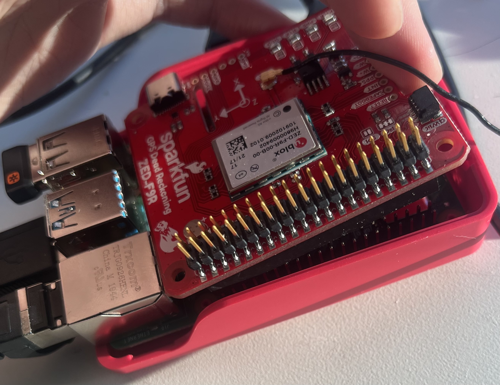

# README 

This is guide on streaming GPS data from SparkFun GPS-RTK Dead Reckoning pHAT for Raspberry Pi (ZED-F9R) through ROS 2. Since ROS 2 does not officially Raspbian, I installed Ubuntu 20.04 on raspberry pi. 

## Install Ubuntu 20.04 on raspberry pi.
---
There is no official image for ubuntu 20.04 desktop for raspberry pi. However, you can install [ubuntu 20.04 server](https://ubuntu.com/download/raspberry-pi) and then install ubuntu-desktop `sudo apt-get install ubuntu-desktop`. [Update: It seems that Lubuntu Desktop is more stable operation on a raspberry pi, I used [desktopify](https://github.com/wimpysworld/desktopify) to install Lubuntu Desktop on my ubuntu server.]

## Enable UART on raspberry pi for Ubuntu
---
This steps enables serial communication from the GPS module to ubuntu.
I followed the guide [here](https://askubuntu.com/questions/1254376/enable-uart-communication-on-pi4-ubuntu-20-04), but I listed them below for your convenience. 

1. Disable serial-getty@ttyS0.service
```
sudo systemctl stop serial-getty@ttyS0.service
sudo systemctl disable serial-getty@ttyS0.service
sudo systemctl mask serial-getty@ttyS0.service
```

2. Setup udev rules, create a new file `/etc/udev/rules.d/10-local.rules` and write the following linse.  
```
KERNEL=="ttyS0", SYMLINK+="serial0" GROUP="tty" MODE="0660"
KERNEL=="ttyAMA0", SYMLINK+="serial1" GROUP="tty" MODE="0660"
```
Reload udev rules: `sudo udevadm control --reload-rules && sudo udevadm trigger`

3. Add user to tty group: `sudo adduser ubuntu tty` (assuming default ubuntu username `ubuntu`, feel free to add your own username.)

4. Delete substring `console=serial0,115200` from `/boot/firmware/cmdline.txt`. There is a single line in this file, just remove the substring from the line.

5. Restart `sudo reboot` 

**When booting raspberrypi, do not plug in the pHAT module. Signals from UART will interrupt boot process. Plugin pHAT after the pi is booted.**

**When plugging in pHAT, tilted the pHAT so that the power pins are connected last. For some reason if the power pins are touched first, raspberrypi will reboot and cause the issue mentioned above.**

**TODO: disable UART temporarily during boot should solve this problem, will update once I manage to get it working.**



## Download ublox python package and customize
---
Download sparkfun ublox package. (Requires Python3 and pip3, spidev.)
```sudo pip3 install spidev```
```sudo pip3 install sparkfun-ublox-gps```

The default package does not provide functions to parse GPS covariance matrix, but we can easily add our own.

In `/usr/local/lib/Python3.x/dist-packages/ublox_gps`,
after function `geo_coords()` on line 196, add another function that parse the covariance.

<pre>
def geo_coords(self):
    # Here we change the message type to COV
    self.send_message(sp.NAV_CLS, self.nav_ms.get('COV'))
    parse_tool = core.Parser([sp.NAV_CLS])
    cls_name, msg_name, payload = parse_tool.receive_from(self.hard_port)
    # There is no scaling factor so we can just return the payload
    return payload
</pre>

Details on ublox messages can be found [here](https://www.u-blox.com/sites/default/files/u-blox-F9-HPG-1.30_InterfaceDescription_UBX-21046737.pdf).

## Download ROS 2
---
Follow the guide [here](https://docs.ros.org/en/foxy/Installation/Ubuntu-Install-Debians.html) to install ROS 2 Foxy. 

## Download the package and build.
---
```
cd [your_ros_ws]/src
git clone https://github.com/FrankBu0616/ros2_zed_f9r_gps.git
cd ..
colcon build
source install/setup.bash
```

To start publishing data, `ros2 run zed_f9r_gps gps_publisher`.
